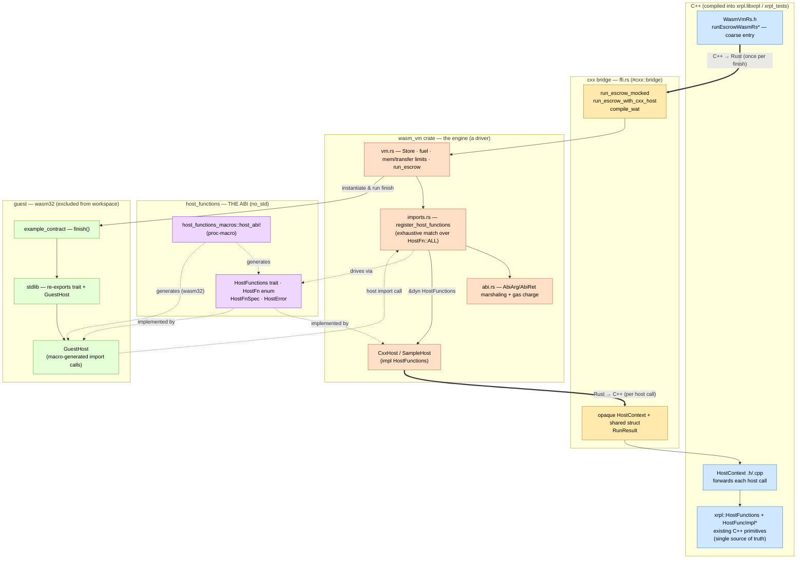

# WASM-VM Rust redesign — PoC

This directory is the C++ face of a **proof-of-concept** for the WASM-VM
redesign described in [`redesign_draft.md`](../../../../redesign_draft.md) (repo
root): moving the programmable-escrow WASM engine from the current
**C++ / wasmi-C-API** implementation to a **Rust-native wasmi engine**, with host
functions forwarded back to the existing C++ primitives over
[`cxx`](https://cxx.rs).

The PoC is complete: it runs escrow WASM end-to-end and exercises every
load-bearing claim of the proposal with tested code. It lives **alongside** — it
does *not* replace — the current C++ engine in
[`include/xrpl/tx/wasm/`](../wasm/) + `src/libxrpl/tx/wasm/`. Nothing on the
production `xrpld` path calls it yet.

This doc is a map for the team reading the implementation. The Rust lives in
[`crates/`](../../../../crates/) (repo root); the C++ shim lives here and in
`src/libxrpl/tx/wasm-rs/`.

## Contents

- [The one idea everything hangs on](#the-one-idea-everything-hangs-on)
- [Component diagram](#component-diagram)
- [Component overview](#component-overview)
  - [Rust](#rust-crates)
  - [C++](#c-side)
- [The two cxx crossings](#the-two-cxx-crossings)
- [The ABI lowering](#the-abi-lowering)
- [Gas & resource limits](#gas--resource-limits)
- [Adding a host function](#adding-a-host-function)
- [Comparison with the current C++ implementation](#comparison-with-the-current-c-implementation)
- [Build & test](#build--test)
- [Known gaps / not done](#known-gaps--not-done)
- [Gotchas](#gotchas)
- [File map](#file-map)

---

## The one idea everything hangs on

There is a **single ABI definition** — the `HostFunctions` trait — declared once,
in the `host_functions` crate, via the `host_abi!` macro. It is *implemented four
ways*, and the engine only ever sees `&dyn HostFunctions`, so it never knows
which:

| Implementation | Where | Role |
|---|---|---|
| `MockHost` / `SampleHost` | `wasm_vm` tests / `ffi.rs` | Rust simulator; engine-only tests |
| `CxxHost` | `wasm_vm` (`ffi.rs`) | **production**: forwards each call to C++ over cxx |
| `GuestHost` | `host_functions` `__guest_impl` (wasm32), re-exported by `stdlib` | guest side: each method *is* a wasm import the contract calls — macro-generated |

Because both sides of the FFI point at this one trait, signatures, types, and
error codes **cannot drift**. Adding a host function is compiler-enforced to be
registered (see [Adding a host function](#adding-a-host-function)).

---

## Component diagram

Colours: **blue** = C++ host logic, **gold** = the cxx FFI boundary, **orange**
= the Rust engine, **purple** = the shared ABI crate (the single source of
truth), **green** = the wasm32 guest. Thick arrows (`==>`) are the two cxx
crossings — the only places the two languages meet.



---

## Component overview

### Rust crates

All under [`crates/`](../../../../crates/), wired to CMake via
[corrosion](https://github.com/corrosion-rs/corrosion) + cxx.

#### `host_functions/` — THE ABI

`#![no_std]` + `alloc`, **no other dependencies**, so the identical crate links
into the native host, the cxx host, and the wasm32 guest. Contents:

- the `HostFunctions` trait — the whole contract, written in ordinary Rust types
  (`&[u8]`, `Vec<u8>`, `&str`, `u32`), saying nothing about wasm memory;
- the `HostFn` enum + `HostFnSpec` (wasm import name + consensus-fixed base gas)
  + `HostFn::ALL`;
- `HostError` — `#[repr(i32)]`, discriminants mirror the C++ `HostFunctionError`
  in [`WasmCommon.h`](../wasm/WasmCommon.h), with `code()` / `from_code()`;
- **the wasm32 guest bindings** (`__guest_impl` module + `GuestHost`).

The trait, enum, `spec()`, `ALL`, *and* the guest bindings are all generated by a
single `host_abi! { … }` invocation. The PoC declares five functions, each
chosen to exercise a distinct ABI shape:

| Function | wasm name | Shape it exercises |
|---|---|---|
| `get_ledger_sqn() -> u32` | `ldgr_index` | scalar out, needs host context |
| `get_current_ledger_obj_field(field: i32) -> Vec<u8>` | `home_le_field` | scalar in, variable-length bytes out |
| `sha512_half(data: &[u8]) -> [u8; 32]` | `sha512_half` | bytes in, fixed-size buffer out |
| `trace(msg: &str, data: &[u8], as_hex: bool)` | `trace` | string + bytes + bool in, unit out |
| `trace_num(msg: &str, number: i64)` | `trace_num` | string + scalar in, unit out |

#### `host_functions_macros/` — the `host_abi!` proc-macro

Parses `#[gas = N] #[wasm = "name"] fn sig;` entries (a missing gas/name is a
compile error) and emits:

- the `HostFn` enum + `spec()` + `ALL`;
- the `HostFunctions` trait (`&self` prepended, return type wrapped in
  `HostResult<_>`, doc comments preserved);
- **behind `#[cfg(target_arch = "wasm32")]`**, the guest side: a
  `#[link(wasm_import_module = "host")]` import block + a `GuestHost` impl that
  marshals each call.

To generate the guest side, the macro encodes the guest lowering (the twin of
`wasm_vm`'s `AbiArg`/`AbiRet` — see [The ABI lowering](#the-abi-lowering)). A
signature using a type outside the supported set is a compile error **on every
target**, so the guest can't silently fall behind. Engine-side registration is
*not* generated (see [gotchas](#gotchas)).

#### `wasm_vm/` — the engine (a driver, **not** a trait impl)

- **`vm.rs`** — `VmState<'h> { host: &'h dyn HostFunctions, … }`, `RunOutcome`,
  `build_wasm_engine`, `run_escrow`. A process-wide wasmi `Engine` (built once;
  its config is consensus-fixed) with a **per-invocation `Store`**, fuel = gas.
  `run_escrow<'h>(wasm, gas, host: &'h dyn HostFunctions, fn_name)` takes the
  host by **shared borrow** — that's what lets `CxxHost` borrow a C++ context for
  one call (wasmi imposes no `T: 'static` on `Store`). Also holds the memory-page
  cap (`StoreLimits`) and the transfer-limit budget.
- **`abi.rs`** — the `AbiArg`/`AbiRet` marshaling traits (wasm scalars ⇄ guest
  memory — the crate's only "unsafe surface", all bounds-checked wasmi slice
  ops), `charged()` (the single gas-charge entry point), the size / transfer
  checks, and `to_wasm_i32/i64`.
- **`imports.rs`** — `register_host_functions`: a `for op in HostFn::ALL { match op { … } }`
  exhaustive match with one `func_wrap` arm per variant. A new `HostFn` won't
  compile until it has an arm here — the "can't forget to register" guarantee.
- **`ffi.rs`** — the `#[cxx::bridge]`: the shared plain-data struct `RunResult`,
  the C++→Rust entries (`run_escrow_mocked`, `run_escrow_with_cxx_host`,
  `compile_wat`), and the Rust→C++ side: the opaque `HostContext` + the
  `CxxHost<'a>` wrapper that implements `HostFunctions` by forwarding to it.
  Value-producing host calls carry no owned result struct across cxx: the
  engine hands C++ a `&mut [u8]` aliasing the guest output region and C++ writes
  its bytes straight into it, returning the byte count (see the wire convention
  below).

#### `stdlib/` — guest side, now just a re-export

`#![no_std]`. Re-exports the trait + `HostError`/`HostResult`/`HASH_LEN`, and
(on wasm32) the macro-generated `GuestHost`. No hand-written ABI lives here
anymore — that duplication is gone. Contract authors still build against this
crate.

#### `example_contract/` — a sample escrow

Compiled to wasm32; **excluded from the workspace** (see `exclude` in
[`crates/Cargo.toml`](../../../../crates/Cargo.toml)) so native / corrosion
builds don't try to compile its `cdylib` + `#[panic_handler]` +
`#[global_allocator]`. Its `finish()` reads the ledger sequence, traces it, and
allows the escrow only once the ledger is past a threshold — a ~600-byte
`.wasm`.

> `hello_world/` is the original corrosion+cxx smoke-test crate, pre-existing and
> unrelated to the VM.

### C++ side

- **[`WasmVmRs.h`](WasmVmRs.h)** — header-only C++ front. `runEscrowWasmRs` /
  `runEscrowWasmRsFromWat` run against the built-in Rust mock host;
  `runEscrowWasmRsFromWatWithCxxHost` services host calls via a C++
  `xrpl::HostFunctions&` (real or mock), forwarded through `HostContext`. This is
  the coarse C++→Rust crossing; it mirrors the shape of the existing
  `runEscrowWasm`.
- **[`HostContext.h`](HostContext.h)** + `src/libxrpl/tx/wasm-rs/HostContext.cpp`
  — the `HostContext` shim: holds `xrpl::HostFunctions& hf` and forwards each
  host call to the **existing C++ primitives** (the single source of truth),
  translating `std::expected` results into the plain-data wire structs cxx
  shares. This is the Rust→C++ crossing.
- **`src/tests/libxrpl/tx/WasmVmRs.cpp`** — the GoogleTest suite driving the
  whole loop: a Rust-mock run, plus four tests that push each host function
  through the cxx path against a `FakeHost` C++ double.
- **CMake** — [`crates/CMakeLists.txt`](../../../../crates/CMakeLists.txt) builds
  the crates + cxxbridge (`add_xrpl_crate`); the bridge target gets `-I include`
  so its generated TU can find `HostContext.h`.
  [`cmake/XrplCore.cmake`](../../../../cmake/XrplCore.cmake) links
  `rs_wasm_vm_cxxbridge` **PUBLIC** into `xrpl.libxrpl.tx`, and `HostContext.cpp`
  is compiled into `xrpl.libxrpl` (via the `src/libxrpl/*.cpp` glob), so
  `xrpl_tests` picks both up transitively. It's dead code in `xrpld` for now.

---

## The two cxx crossings

**C++ → Rust** (coarse, once per finish): `runEscrowWasmRs*` → `run_escrow`.
Low-risk; cxx handles it cleanly.

**Rust → C++** (fine, per host call): `CxxHost` (Rust, `HostFunctions` impl) →
opaque `HostContext` (cxx) → `xrpl::HostFunctions` / `sha512Half` etc.

A single run against the C++ host looks like this:

```mermaid
sequenceDiagram
    participant T as C++ test / caller
    participant B as cxx bridge (ffi.rs)
    participant E as wasm_vm engine
    participant G as guest (finish)
    participant H as CxxHost (Rust)
    participant C as HostContext (C++)
    participant P as xrpl::HostFunctions

    T->>B: runEscrowWasmRsFromWatWithCxxHost(wat, hf, gas)
    Note over T,B: C++ to Rust (once)
    B->>E: run_escrow(wasm, gas, CxxHost, "finish")
    E->>G: call finish()
    G-->>E: host import sha512_half(ptr, len, out, cap)
    E->>E: charge base gas; read input from guest memory
    E->>H: host.sha512_half(data, out)  [out aliases guest memory]
    H->>C: ctx.sha512_half(data, out)
    Note over H,C: Rust to C++ (per call)
    C->>P: hf.computeSha512HalfHash(Slice)
    P-->>C: expected Hash
    C->>C: memcpy digest straight into out (guest memory)
    C-->>H: i32 byte count (or negative error)
    H-->>E: HostResult<usize> (bytes written)
    E->>E: enforce cap / buffer-fit / transfer budget from length
    E-->>G: i32 status (byte count, or negative error)
    G-->>E: finish() returns i32
    E-->>B: RunOutcome (result, fuel_used)
    B-->>T: EscrowRunResult
```

**Wire convention.** An `i64`/`i32` `>= 0` is a value or byte length; `< 0` is a
`HostError` code (both sides map through `HostError::from_code` / C++
`hfErrorToInt`, so the *same* negative number means the *same* error to guest,
Rust host, and C++). Every value-producing call — variable- or fixed-length
alike — writes its bytes straight into the guest output buffer: the host
receives a `&mut [u8]` aliasing guest linear memory and returns the byte count
(`>= 0`) it wrote, so there is no owned buffer or result struct to marshal
across cxx.

---

## The ABI lowering

Both sides agree, by construction, on how each Rust type maps to wasm scalars —
the engine implements it in `abi.rs` (`AbiArg`/`AbiRet`) and the macro emits the
mirror image for the guest. This is the table both encode:

| Rust (argument) | wasm scalars the guest passes |
|---|---|
| `i32` / `i64` | the value |
| `bool` | `x as i32` |
| `&[u8]` / `&str` | `(ptr, len)` into guest linear memory |

| Rust (return) | import signature / decoding |
|---|---|
| `()` | returns `i32` status; `< 0` = error |
| `u32` | returns `i64`; `< 0` = error |
| `Vec<u8>` | caller passes `(out_ptr, out_len)`; the import writes into it and returns the `i32` byte count |
| `[u8; N]` | caller passes `(out_ptr, out_len)`; the import writes into it and returns the `i32` byte count |

A signature outside this set is a compile error, on every target.

Every value-producing return (`Vec<u8>` and `[u8; N]` alike) uses the
*fill-the-caller's-buffer* shape rather than an owned return. Its **trait**
method becomes `fn(&self, .., out: &mut [u8]) -> HostResult<usize>` (bytes
written), and the engine hands that `out` slice straight through to guest linear
memory (`abi.rs`'s `write_into`), so the host — including the `CxxHost`
forwarding to C++ — writes once, directly into wasm memory, with no owned
intermediate. The engine keeps the field-size cap, buffer-fit (`BufferTooSmall`)
and transfer-budget policy by having the host report the value's *true* length.
A fixed-size `[u8; N]` is treated identically to a dynamic `Vec<u8>`; the
declared size is documentation.

---

## Gas & resource limits

Three guardrails from the C++ engine are ported (the `// mirrors …` comments in
the Rust cite the exact C++ line):

| Limit | Value | Where (Rust) | Mirrors (C++) |
|---|---|---|---|
| Linear-memory page cap | 128 pages (8 MiB) | `vm.rs` `MAX_MEMORY_PAGES`, via `wasmi::StoreLimits` + `Store::limiter` | `WasmVM.h` `maxPages` |
| Per-run transfer limit | 1 MiB | `vm.rs` `TRANSFER_LIMIT_BYTES`, `VmState::transfer_budget` (charged in `abi.rs`) | `Protocol.h` `kWasmTransferLimit` |
| Per-field size cap | 1 KiB | `abi.rs` `MAX_WASM_DATA_LEN`, checked in `read_bytes` (before any alloc) and in `write_into` (from the host's reported length) | `Protocol.h` `kMaxWasmDataLength` |

**Gas** is wasmi fuel. Each host call is charged its `#[gas = N]` base cost
exactly once, through the single `charged()` helper in `abi.rs` — so gas can't be
forgotten. Guest instructions consume fuel too. `RunOutcome.fuel_used` reports
the total.

> The C++ `unalignedGas` / `FieldLocator` alignment-copy charge is **deferred** —
> the PoC has no `FieldLocator` host functions yet to attach it to.

---

## Adding a host function

Adding a *working, production* host function touches a **comparable number of
places** to the current C++ engine — the Rust→C++ boundary means each function
still needs a forwarding shim. The win is **not fewer edits**; it's that the
edits are **compiler-enforced to stay consistent** and the **guest side is
generated** rather than hand-written.

The full path for a new function:

1. **`host_abi!` entry** (`host_functions/src/lib.rs`) — signature, wasm name,
   and gas, in one place:
   ```rust
   /// Doc comment carries over to the trait method.
   #[gas = 100]
   #[wasm = "my_new_fn"]
   fn my_new_fn(field: i32, data: &[u8]) -> Vec<u8>;
   ```
   This alone produces the `HostFn::MyNewFn` variant + `spec()`, the trait
   method, **and the wasm32 guest binding** — the guest needs no hand edits.
   (This *is* a genuine reduction vs. the current engine, where the guest
   `HostBindings` trait and its impls are edited by hand.) A missing
   `#[gas]`/`#[wasm]`, or a type outside the [lowering table](#the-abi-lowering),
   is a compile error.

2. **`register_host_functions` arm** (`wasm_vm/src/imports.rs`) — the new
   `HostFn` variant makes the exhaustive `match` fail to compile until you add a
   `func_wrap` arm that marshals args/results via `AbiArg`/`AbiRet` inside
   `charged(...)`.

3. **`CxxHost` impl** (`wasm_vm/src/ffi.rs`) — decode the wire result into a
   `HostResult`.

4. **The C++ forwarding shim** — a declaration in the cxx bridge's `extern
   "C++"` block (`ffi.rs`), a matching declaration in
   [`HostContext.h`](HostContext.h), and an implementation in `HostContext.cpp`
   that calls the underlying `xrpl::HostFunctions` primitive and packs the
   result into the wire type. cxx fails to compile if the C++ signature doesn't
   match the bridge.

(The underlying `xrpl::HostFunctions` primitive is the same work in either
design — it's the shared source of truth for ledger semantics.)

So the edit count is a wash. What changes is that **nothing can silently drift**:
the engine won't compile without its `match` arm, the guest is generated so it
*can't* fall behind, and the C++ shim is cxx-type-checked against the bridge — a
mismatch is a build error, not a latent bug. In the current engine those
guarantees rest on convention and tests. Contrast the current engine's
[six manual steps](../wasm/README.md#adding-a-new-host-function).

---

## Comparison with the current C++ implementation

The current engine ([`include/xrpl/tx/wasm/`](../wasm/)) drives wasmi through its
**C API** (Conan `wasmi/1.0.9`); the PoC drives the **native wasmi Rust crate**
and only crosses to C++ over cxx.

| Aspect | Current (C++ / wasmi C API) | PoC (Rust-native + cxx) |
|---|---|---|
| Interpreter access | wasmi **C API**, hand-written RAII wrappers | native **wasmi crate**, no C API |
| How wasmi is sourced | prebuilt Conan `wasmi/1.0.9` C package (`find_package(wasmi)`) | `wasmi` `1.1.0` crate, built from source by cargo/corrosion (Rust is already in the tree) |
| Import type recovery | `boost::mpl` / `function_types` metaprogramming reconstructs param/result types | native typed Rust closures (`func_wrap`) |
| Import dispatch | one trampoline + a per-fn metadata table; C-style `_proto`/`_wrap` over `wasm_val_vec_t` | `register_host_functions` exhaustive `match`, one arm per `HostFn` |
| ABI source of truth | two independent definitions — C++ `HostFunc.h` base class **and** the guest `HostBindings` trait — kept in sync by convention | one authoritative definition (`host_abi!` trait); C++ `HostContext` restates each signature but as a cxx-checked *binding*, not a rival definition |
| Guest-memory access | manual pointer+length with hand-rolled bounds / alignment / endianness | bounds-checked wasmi slice ops, isolated in `abi.rs` |
| Concurrency | process-wide singleton behind a `std::mutex`; runs serialized | per-invocation `Store`; no shared state, no mutex |
| Traps / errors | C++ exceptions caught and converted to traps | ordinary Rust `Result` |
| Add a host function | ~6 places + the hand-edited guest trait; consistency by convention/tests | comparable place count (ABI entry, engine arm, `CxxHost`, cxx-bridge + `HostContext` .h/.cpp), but guest side generated and drift is compiler-enforced |
| Host-fn count | ~60 methods (full spec) | 5 (one per ABI shape) |

**What stays the same: the C++ host-function implementations.** The concrete
code that does the work — `WasmHostFunctionsImpl` / `HostFuncImpl*.cpp`, which
read the ledger via `ApplyContext`, compute `sha512Half`, do the float/keylet
math, etc. — is **reused unchanged**. The PoC replaces only the engine and the
import/marshaling layer; it then calls back into those same implementations
through `HostContext` → `xrpl::HostFunctions`. So ledger semantics, gas *values*,
and error codes are unchanged by construction. (The proposal's framing is that
the current engine has no live consumers yet, so adopting this is a design
choice, not a migration.)

**Performance is not yet measured.** Driving the native crate removes the
per-call C-API marshaling the current engine pays, but the PoC adds a cxx
crossing on *every* host call (the fine-grained Rust→C++ path). Which dominates
on the hot path is an open question — no benchmarks exist yet, so the comparison
above is about design properties, not speed.

---

## Build & test

Rust only (fast):

```sh
cd crates
cargo test -p wasm_vm -p host_functions
cargo build -p stdlib --target wasm32-unknown-unknown   # needs: rustup target add wasm32-unknown-unknown
cd example_contract && cargo build --target wasm32-unknown-unknown --release
```

Full C++↔Rust loop (needs the CMake/Conan build; `build/` is Ninja + Debug,
tests on):

```sh
cmake --build build --target xrpl_tests
./build/xrpl_tests --gtest_filter='WasmVmRs.*'
```

---

## Known gaps / not done

- **Only 5 host functions** — enough to cover every ABI shape, not the full ~60.
- **No production wiring** — `HostContext` is exercised via `FakeHost` in tests;
  attaching it to a real `ApplyContext` on the `xrpld` escrow-finish path is
  future work. The engine is dead code in the daemon today.
- **No preflight / amendment gating** — the current engine's
  `preflightEscrowWasm` and amendment-gated registration have no PoC equivalent.
- **`unalignedGas` / `FieldLocator` alignment charge** deferred (no
  `FieldLocator` host fns yet).
- **Engine-side registration is hand-written**, not macro-generated (see the
  `// TODO` in `imports.rs`) — a deliberate choice to keep all wasmi-facing code
  in `wasm_vm`.
- Possible optimisations noted in the code: typed newtypes for keylets /
  `AccountID`. (The extra copy on the value-producing paths — a host-side
  `Vec<u8>` / `[u8; N]` / cxx result struct, then a copy into guest memory — is
  **gone**: every value-producing return now lowers to a fill-the-caller's-buffer
  shape, so the host (Rust or C++) writes straight into guest linear memory in a
  single copy. See "The ABI lowering".)

---

## Gotchas

- **cxx opaque C++ types are `!Sized`**, so you can't coerce `&ffi::HostContext`
  to `&dyn HostFunctions`; the `CxxHost<'a>` wrapper exists to carry the trait
  impl.
- **The cxxbridge-generated TU only gets `-I include`** (no Boost). So the
  `include!`'d `HostContext.h` must not pull heavy headers — it forward-declares
  `xrpl::HostFunctions`; the real `<xrpl/tx/wasm/HostFunc.h>` include lives in
  `HostContext.cpp` + `WasmVmRs.h`, which are compiled where Boost is on the path.
- **wasm32 contracts must match the engine's disabled features**: build with
  `-C target-feature=-bulk-memory,-sign-ext,-multivalue,-reference-types,-nontrapping-fptoint,-extended-const`
  (keep `mutable-globals` — the shadow stack needs it). See
  `crates/example_contract/.cargo/config.toml`.
- **Edition 2024**: extern blocks are `unsafe extern "C"`; export attrs are
  `#[unsafe(no_mangle)]`.
- **rust-analyzer / clangd false positives** on the generated cxx headers
  (`rust/cxx.h`, `*_cxxbridge/ffi.h` "not found") and stale `#[cfg]` errors are
  expected — those headers are generated at CMake build time. Trust `cargo` /
  `cmake --build`, not the language servers, for the cxx boundary.

---

## File map

```
include/xrpl/tx/wasm-rs/
  README.md              ← this file
  WasmVmRs.h             coarse C++ → Rust entry (header-only)
  HostContext.h          Rust → C++ shim (declarations; forward-decls HostFunctions)

src/libxrpl/tx/wasm-rs/
  HostContext.cpp        forwards host calls to xrpl::HostFunctions primitives

src/tests/libxrpl/tx/
  WasmVmRs.cpp           GoogleTest suite (mock host + cxx-host path)

crates/
  host_functions/        THE ABI: HostFunctions trait, HostFn, HostError (via host_abi!)
  host_functions_macros/ the host_abi! proc-macro (also emits the wasm32 guest side)
  wasm_vm/               the engine: vm.rs, abi.rs, imports.rs, ffi.rs (the cxx bridge)
  stdlib/                guest crate — re-exports trait + GuestHost
  example_contract/      sample escrow, compiled to wasm32 (excluded from workspace)
  hello_world/           pre-existing corrosion+cxx smoke test (unrelated)
```
