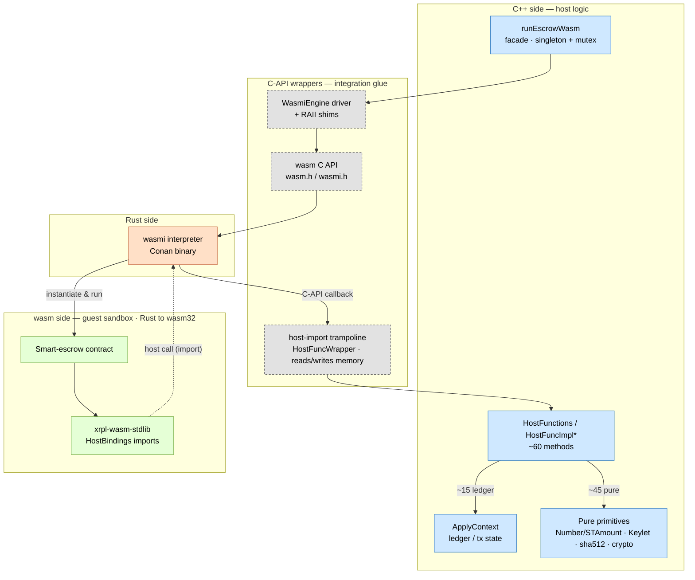
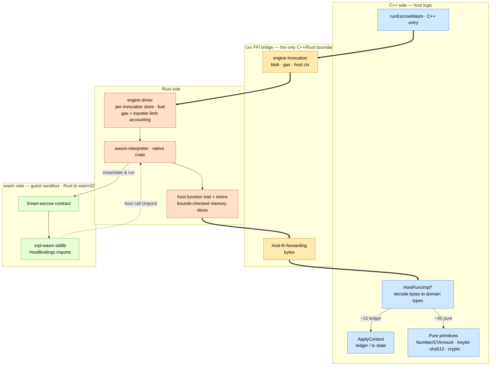

# WASM VM Redesign Draft — Rust/cxx host

**Scope:** the design of adding a WASM engine to xrpld — the engine driver and
host-import layer that executes escrow-finish WebAssembly — and, within that,
whether to build the layer in Rust (native wasmi crate, bridged to C++ via
`cxx`) or in C++ over the wasmi C API.

**Framing.** The current implementation is not yet used by anyone, so a change
in design would not require any migration — there is no live behavior to
preserve or transition. That lets us weigh the options on their design merits
rather than on transition cost.

**Terminology.**

- **Host** — the native code embedded in xrpld that runs the wasm engine and
  implements the host functions. C++ today; this proposal moves the engine and
  import layer to Rust.
- **Guest** — a smart-escrow contract compiled to WebAssembly and executed in the
  sandbox.
- **Host functions** — the imports the guest calls to read ledger/transaction
  data and to run float, keylet, hashing, signature, and trace operations.
- **Guest crate (`xrpl-wasm-stdlib`)** — the published Rust library contract
  authors build against; it defines the guest side of the host-function ABI
  (signatures, error codes, conventions).
- **wasmi** — the WebAssembly interpreter (a Rust crate).
- **[`cxx`](https://cxx.rs)** — the Rust↔C++ bridge crate.

---

## 1. Current design

### Layering

Four zones — **C++ host logic**, blue; the **C-API wrappers** that drive the
interpreter and receive its callbacks, grey/dashed; the **Rust** interpreter,
orange; the **wasm guest**, green. C++ reaches the interpreter through the C API,
and the guest calls back through it into the C++ host functions.

### How it works today

- **Engine.** wasmi (a Rust interpreter) is used through its C API, vendored as
  the Conan `wasmi/1.0.9` package. Hand-written RAII wrappers wrap the raw C
  handles, and `boost::mpl`/`function_types` metaprogramming recovers each
  import's param/result types from its signature — the layer that glues a Rust
  library through C into C++.

- **Driver.** A process-wide singleton engine behind a `std::mutex`: one module
  runs at a time, so wasm execution is serialized. It configures fuel metering,
  instantiates the module, and calls the exported `finish`.

- **Host imports.** All imports funnel through a single trampoline with a
  per-function metadata table (name, gas cost, param/result types). Per-call gas
  charging and param/result validation happen there; C++ exceptions are caught
  and converted to traps.

- **Memory.** C++ reads arguments directly out of wasm linear memory as raw
  `pointer + length` (with its own bounds checks, alignment, and endianness
  handling) and writes results back, charging the memory transfer limit.

- **Host functions.** ~60 virtual methods returning
  `Expected<T, HostFunctionError>`. Only ~15 read the ledger (`ApplyContext`);
  the rest are pure functions of their inputs:

  | Category | Reads ledger? |
  |---|---|
  | float math, keylet derivation, `sha512Half` / signature check, trace | no |
  | field & array getters, ledger-header reads, NFT reads, `cacheLedgerObj`, `updateData` | yes |

- **Gas + transfer-limit accounting.** Computed in the C++ call path; the numbers
  are consensus-visible.

- **Existing seams.** The runtime interface and the host-function base are
  virtual and are mocked in tests today.

- **Guest side.** Contracts are Rust compiled to `wasm32` against the
  `xrpl-wasm-stdlib` crate (with `xrpl-escrow-stdlib` for escrow entry-point
  helpers). Its `HostBindings` trait defines the host/guest ABI — every function
  `(ptr, len, …) -> i32` — with three implementations: the real wasm FFI imports,
  an empty stub for native builds, and a `mockall` mock covering all ~60
  functions. No shared host-side crate yet.

---

## 2. Proposed design

Drive the **native wasmi crate** from Rust; expose a narrow, coarse-grained
entry point to C++ via `cxx`; forward host functions from Rust back to the
existing C++ implementations.

Same four sides, but the C-API-wrappers band collapses into a thin **`cxx` FFI
bridge** (gold) and the driver moves into **Rust** (orange). C++ (blue) is
reached only across the gold band — once per run, and once per host-function
call. Thick arrows are the two `cxx` crossings; the gold band is the only place
the languages meet.

### Direction of the FFI (the key design axis)

- **C++ → Rust (engine invocation):** one coarse call per escrow finish — "run
  this blob with this gas limit and this host context, return `i32` result +
  cost." `cxx` handles this cleanly; low risk.
- **Rust → C++ (host callbacks):** wasmi (Rust) calls back into C++ which owns
  `ApplyContext`. This is the fine-grained, higher-frequency path and the real
  design work.

### What moves to Rust

- Engine and module lifecycle, fuel configuration, and memory limits run on the
  native wasmi crate directly — no C API in between.
- Host imports are registered as native Rust closures whose signatures carry
  their types, so the C-API shim and the metaprogramming that reconstructed
  those types are no longer needed.
- All guest-memory access becomes bounds-checked Rust slices; the manual pointer
  arithmetic, bounds checks, and endianness handling disappear.
- Gas (fuel) and transfer-limit accounting move into the Rust engine, which sees
  every byte crossing the boundary.
- Each invocation gets its own store. The current mutex exists only because one
  shared engine reuses a single module slot and serializes runs; per-invocation
  stores remove that shared state and the mutex with it. It is not a wasmi
  requirement, nor is it guarding global rounding state — `Number`'s rounding mode
  is thread-local.
- Traps become ordinary Rust errors.

### What stays in C++ (single source of truth)

- **All host-function bodies are forwarded to C++ over `cxx`.** We do **not**
  reimplement pure functions (float math, keylet layout, `STAmount`, crypto) in
  Rust — that would be a second implementation of consensus-critical logic and a
  divergence risk. The consensus code is the primitives these wrappers call
  (`Number`/`STAmount`, `Keylet`, `sha512Half`, signatures), long-established
  across rippled; forwarding to them keeps a single source of truth.
- C++ receives an already-bounds-checked byte slice from Rust, decodes it into
  domain types with its existing validation/error codes, runs the existing impl,
  and returns a byte buffer; Rust writes it back into guest memory. **C++ no
  longer touches guest memory directly.**

### The host-function trait

- The engine calls host functions through a Rust trait — the same shape the guest
  crate's `HostBindings` already defines for the other side of the boundary. What
  varies between environments is not the whole surface but which functions need an
  *alternate* implementation.
- **Ledger functions (~15)** genuinely need swappable implementations: in
  production they read `ApplyContext`; in a simulator they read a synthetic
  ledger. This subset *is* the "ledger environment."
- **Pure functions (the majority — float, keylet, hashing, signature check)**
  have exactly one real implementation: the C++ primitives the production host
  forwards to. They can still sit behind the same trait for uniformity and
  testing, but there is no second implementation to author.
- The distinction worth protecting is *reimplementation*, not *mockability*.
  Mocking a pure function with canned values — which the guest crate already does
  for contract unit tests — is fine; shipping a divergent second real
  implementation in Rust is not. So the design keeps a single real implementation
  (C++) for the pure functions regardless of whether they are also exposed through
  the trait.
- Exact trait scope — all functions vs. ledger-only — is a decision to finalize;
  the guest crate's all-in-one `HostBindings` is a working precedent for the
  broader shape.

### What a Rust host could add on the `xrpl-wasm-stdlib` side

- With the host in Rust, the host functions themselves are Rust: the unsafe
  `cxx`→C++ calls can be wrapped into a **safe, typed Rust implementation** of the
  host-function interface — the mirror image of what the guest crate already does
  over the wasm-import ABI. (Feasibility depends on how cleanly the C++ primitives
  link without the full ledger context; treat it as a hypothesis to validate.)
- That makes it possible to define the host-function interface — signatures,
  types, error codes — **once** and share it across the boundary: the guest calls
  it (compiling to wasm imports), the host implements it (production = forward to
  C++; simulation = synthetic ledger). Less drift than maintaining two sides by
  hand.
- The whole simulator can then be Rust: the real wasm engine plus a mocked ledger
  environment, letting contract authors run their unit tests locally against
  actual execution rather than only mocked host bindings.
- Because gas/fuel accounting now lives in the Rust engine, that same engine lets
  developers measure and verify their contracts' gas costs locally, with the same
  accounting production uses.

### Build / supply chain

- `corrosion` + `cxx` codegen wired into CMake — a **draft PR already exists**
  ([XRPLF/rippled#7034](https://github.com/XRPLF/rippled/pull/7034)), which removes
  the largest adoption cost.
- Consume wasmi as an audited crate tree (`cargo audit` + `cargo deny` for
  advisories/licenses/duplicate versions) instead of the opaque Conan binary.
- Reproducible builds remain mandatory for validators: commit `Cargo.lock`, pin
  the toolchain, decide vendoring vs. locked fetch, across all target platforms.

---

## 3. Pros and cons of moving

### Pros

- **Drops bespoke complexity.** The C-API shim, the metaprogramming that
  reconstructed import types, and the hand-rolled C-API RAII wrappers all
  disappear in favor of the native wasmi crate.
- **Concentrated memory safety.** The only unsafe surface — guest-memory access —
  moves into a thin, bounds-checked Rust layer; the C++ that remains works on
  already-validated byte slices.
- **Single source of truth preserved.** Host-function bodies are forwarded to the
  existing C++ primitives, so there is no second implementation of consensus
  math, keylet, or crypto logic to keep in sync.
- **Removes shared engine state + mutex.** Each invocation gets its own store,
  eliminating the single shared module slot and the lock that serializes runs
  today. Primarily a cleanliness and testability win — concurrency isn't a
  current bottleneck, and no hidden global state relied on the lock (rounding is
  thread-local).
- **A local simulator for contract developers.** With the engine in Rust, the
  whole simulator can be Rust — real wasm execution plus a mocked ledger — so
  authors run unit tests against actual execution (not just mocked host bindings)
  and verify gas costs locally with the same accounting production uses.
- **One interface, less drift.** Host and guest can share a single definition of
  the host-function interface (signatures, types, error codes) instead of
  maintaining both sides by hand.
- **Supply-chain transparency.** An auditable crate tree with `cargo audit` /
  `cargo deny` replaces the opaque prebuilt Conan binary.
- **Timing / no migration burden.** The engine layer isn't gated into consensus
  yet: no amendment gating, no dual-path maintenance, no old-vs-new behavior diff.
  We choose an architecture before committing one, rather than rewriting a live
  system.
- **Contained change.** A Rust engine replaces the C-API integration layer; the
  host-function logic itself is reused through the bridge (its decode step
  relocates to the boundary). The change is confined to the integration seam.

### Cons / risks

- **Per-function bridging.** Each host function still decodes bytes from guest
  memory into C++ domain types, so the marshaling isn't removed — it splits across
  the boundary. Volume is comparable to today's wrappers, but safer (wasmi's
  bounds-checked slices replace raw pointer handling) and reducible on the Rust
  side — macro-generated shims or a single dispatch entry instead of ~60
  hand-written bridges.
- **Unwinding now crosses a language boundary.** Today exceptions stay within C++
  and are caught at the trampoline. With the engine in Rust, a C++ exception
  unwinding into Rust — or a Rust panic into C++ — is undefined behavior, so each
  side must contain it (catch C++ exceptions before returning; Rust
  `panic = abort`). This discipline is new to the two-language design.
- **Consensus-visible accounting relocates to Rust.** Gas and transfer-limit
  accounting move from the C++ call path into the Rust engine, so that logic is
  reimplemented there (including whatever becomes of the `unalignedGas`
  surcharge). Pre-production, so there's no legacy behavior to match — but the
  numbers are consensus-critical once shipped and must be specified deliberately.
  Worst case, if they ever need to change post-launch, amendment (feature-flag)
  state can be passed into the Rust engine so the change is amendment-gated just
  as it is in C++ today.
- **The per-call boundary is swapped, not added.** wasmi already invokes a C-API
  callback into C++ on every host call today; the switch replaces that with a
  `cxx` call of comparable cost. The net performance change should be negligible —
  but it's a regression vector to measure, not assume.
- **Introducing Rust to the build.** There is no Rust in rippled today; the engine
  links a prebuilt Conan wasmi binary. The switch brings in the Rust toolchain and
  a crate tree and puts Rust on the consensus path, so reproducible builds,
  toolchain pinning, and `Cargo.lock`/vendoring become mandatory. This is a real
  new dependency — but the community supports adding Rust
  ([XLS discussion #533](https://github.com/XRPLF/XRPL-Standards/discussions/533)),
  and the groundwork is partly done (corrosion + `cxx` wiring,
  [#7034](https://github.com/XRPLF/rippled/pull/7034)).

---

## 4. Conclusion

Moving the wasm engine into Rust looks beneficial, and the timing is right: the
layer is pre-production, so we can choose the architecture once, with no migration
to carry.

**The wins.** The bespoke C-API glue and its metaprogramming give way to the
native wasmi crate; the one unsafe surface — guest-memory access — is concentrated
in a thin, bounds-checked Rust layer; and consensus logic stays single-sourced by
forwarding host functions to the existing C++ primitives. Per-invocation stores
remove the shared engine state and its mutex. And because the engine becomes Rust,
contract developers can get a Rust simulator (real engine + mocked ledger) for
local unit tests and gas checks, over a host/guest interface that can be defined
once rather than maintained on both sides.

**What will be challenging.** Most of the work is the Rust↔C++ callback boundary:
per-function byte bridging (safer and reducible, but still there), and containing
exceptions and panics so neither unwinds across the FFI. The consensus-visible gas
and transfer-limit accounting moves into Rust and must be specified deliberately.
And the switch introduces Rust to the rippled build for the first time — a real
new dependency, though one the community backs and that is already partly in
place.
